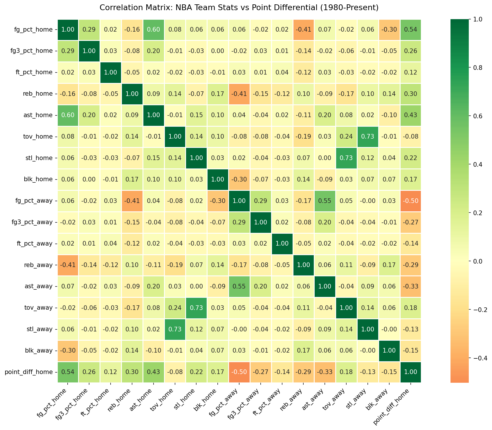
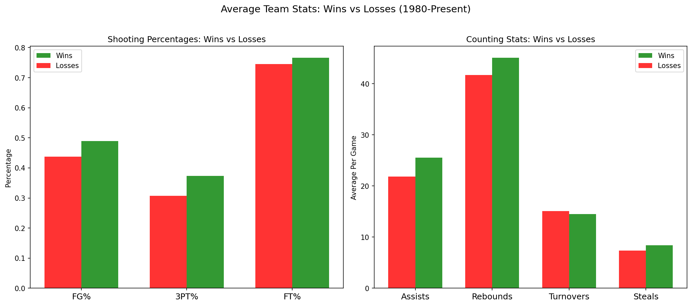
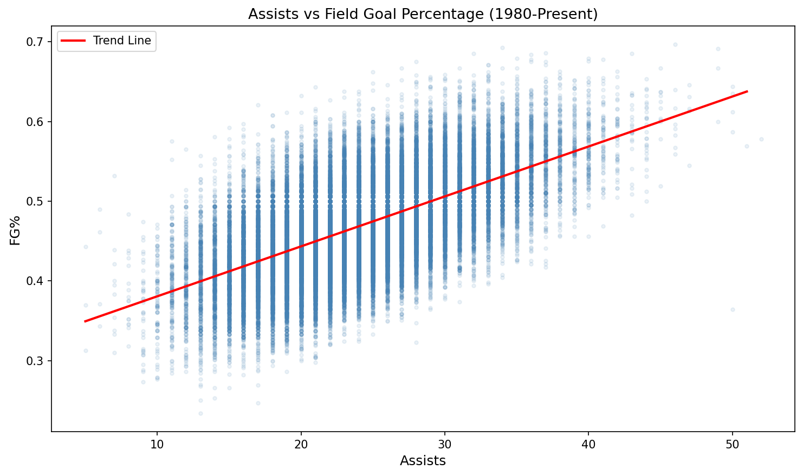
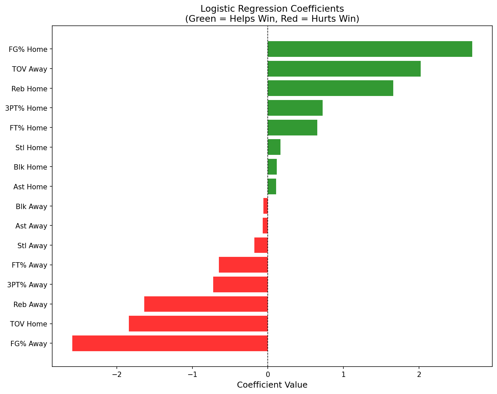

# What Actually Wins NBA Games?
### A Data Analysis & Machine Learning Project
**Tools:** Python, pandas, matplotlib, seaborn, scikit-learn  
**Dataset:** Kaggle NBA Database — 65,000+ games since 1946  
**Author:** Ben Alexander

---

## Overview
This project analyzes 47,502 NBA regular season games from 1980 to present 
to determine which team statistics most strongly predict winning. Starting 
from a broad question — what actually wins NBA games? — I worked through 
exploratory data analysis, hypothesis testing, and a logistic regression 
model to find a data-driven answer.

---

## Key Findings
- **Field goal percentage** is the single strongest predictor of winning
- **Turnovers** appeared irrelevant in early analysis but emerged as the 
  2nd and 3rd most important features in the model — home and away 
  turnovers were cancelling each other out in raw averages
- **Assists and FG% are strongly correlated (r=0.603)** — ball movement 
  drives shooting efficiency
- **Home teams win 60.6%** of regular season games since 1980
- A logistic regression model predicted game outcomes with **91.5% accuracy**
  vs. a 60.6% naive baseline

---

## Project Structure
nba-wins-analysis/
│
├── notebooks/
│   └── analysis.ipynb       # Full analysis notebook
│
├── visuals/
│   ├── correlation_heatmap.png
│   ├── wins_vs_losses_bars.png
│   ├── assists_vs_fgpct.png
│   └── feature_importance.png
│
└── README.md

---

## Visualizations
### Correlation Heatmap

### Wins vs Losses — Key Stats

### Assists vs FG% Scatter Plot

### Feature Importance

---

## Methodology
1. Filtered to modern era regular season games (1980–present)
2. Compared average stats between wins and losses
3. Built a correlation matrix across 16 key features
4. Tested the hypothesis that assists drive FG%
5. Trained a logistic regression model on an 80/20 train/test split
6. Visualized model coefficients to identify feature importance

---

## Limitations & Future Work
- This model uses **in-game stats** to predict outcomes — in reality these 
  stats aren't known until the game is over. A true predictive model would 
  use season averages as inputs.
- Future extension: apply this same analysis to **playoff data** to test 
  whether the same factors predict postseason success.
- Future extension: build a **pre-game prediction model** using rolling 
  season averages.

---

## Data Source
[Kaggle NBA Database](https://www.kaggle.com/datasets/wyattowalsh/basketball)
